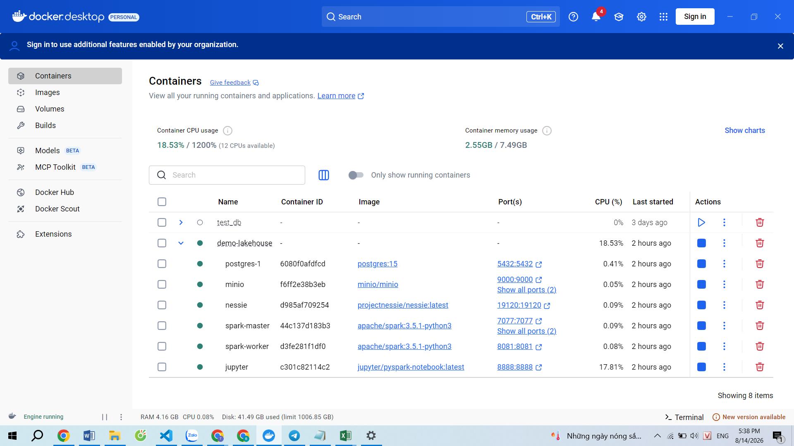
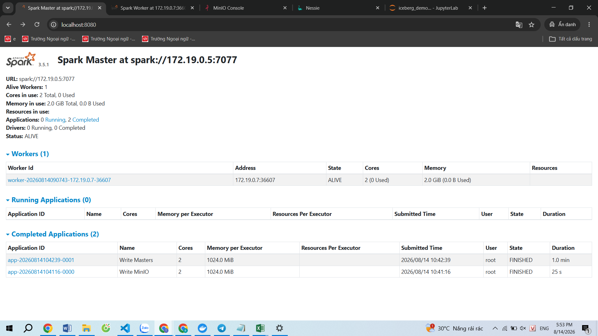
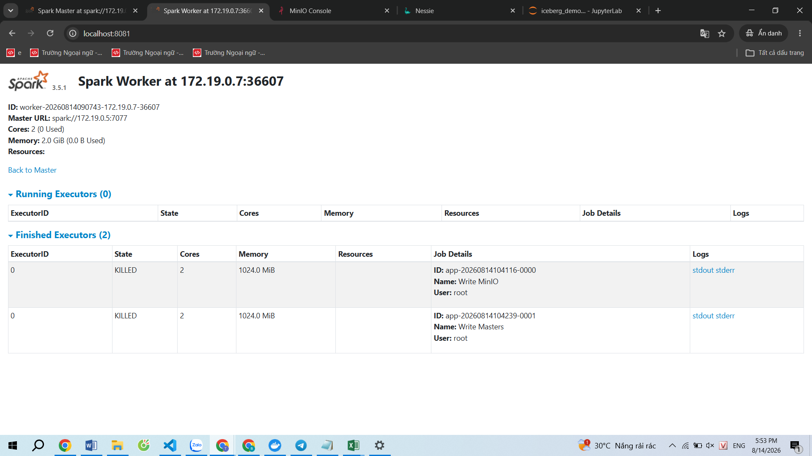
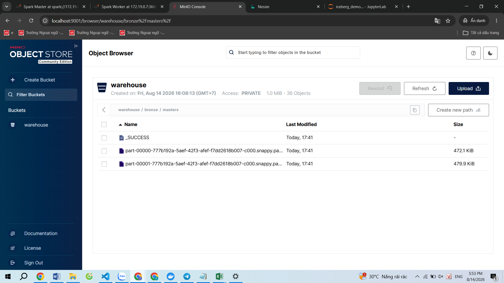
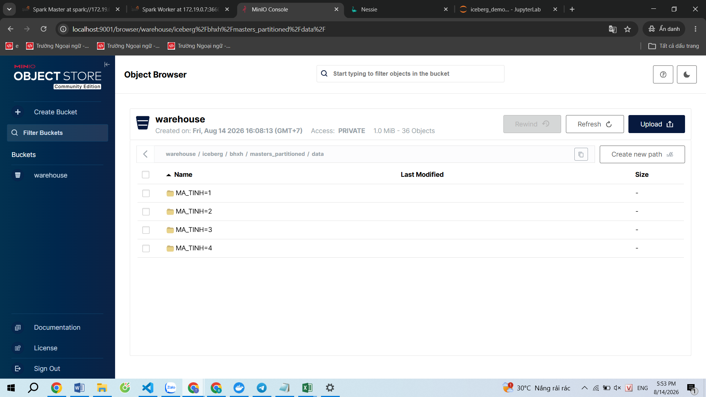

## Phase 1 — Infrastructure

### Đã làm

- Dựng môi trường bằng Docker Compose.
- Cấu hình Spark Master.
- Cấu hình Spark Worker.
- Kết nối Spark Worker với Spark Master.

### Screenshot

#### Docker Compose

#### Spark Master

#### Spark Worker

## Phase 2 — Spark ETL

### Đã làm trong file: \spark\apps\read_masters.py

- Đọc dữ liệu bằng PySpark.
- Chuyển dữ liệu thành DataFrame.
- Chuẩn hóa dữ liệu.
- Xử lý dữ liệu không hợp lệ.

## Phase 3 — MinIO Object Storage

### Đã làm trong file: \spark\apps\write_minio.py

- Cấu hình MinIO làm Object Storage.
- Kết nối Spark với MinIO thông qua S3A.
- Ghi dữ liệu dưới dạng Parquet.

### Screenshot

## Phase 4 — Apache Iceberg

### Đã làm và lưu trong file: \notebook\iceberg_demo.ipynb

- Tích hợp Apache Iceberg với Spark.
- Tạo Iceberg Table.
- Lưu dữ liệu trên MinIO.
- Kiểm tra Iceberg metadata.
- Thực hành Snapshot.
- Thực hành Time Travel.
- Thử UPDATE / DELETE.
- Thực hành Partition.

### Screenshot

#### Iceberg Table trên MinIO

#### Snapshot

